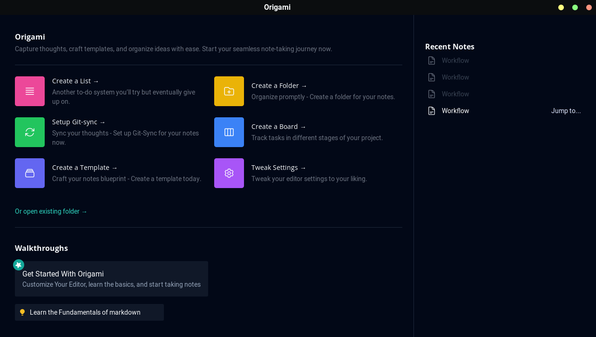
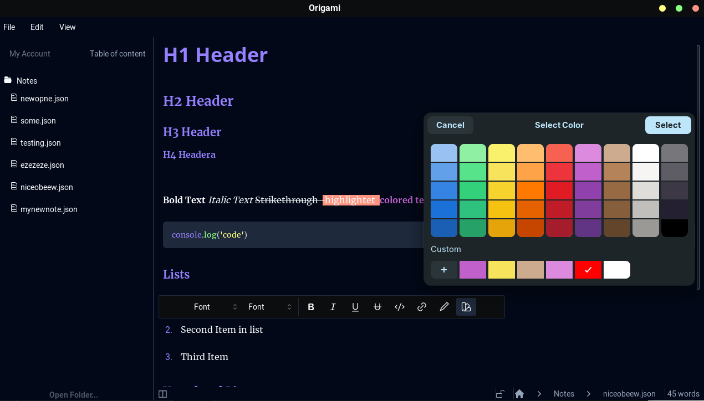

  

<h1 align="center"> WSIWYG Markdown Note Taking App</h1>

## Project Description

Hey there! 👋 Welcome to the Markdown Note Taking App. I'm just your regular student who found taking notes a tad too dull and decided to amp it up a bit. This project brings together a bunch of technologies I love: SvelteKit, Tauri, and AI functionalities. The main star🌟, however, is its WYSIWYG (What You See Is What You Get) Markdown editing. This way, note-taking becomes smoother and way cooler.

## Table of Contents
- [Features](#features)
- [Roadmap](#roadmap)
- [Installation Instructions](#installation)
- [Usage Guidelines](#usage)
- [Credits](#credits)

## Features
The app so far can do:
- WYSIWYG Markdown editing (pretty neat!)
- Saving, creating, and deleting notes (actual note-taking)
- Custom titlebar (for that sleek look)
- An easy-to-navigate homepage

## Roadmap
Currently brewing in the code roadmap🧙‍♂️:
- Integrating more AI functions
- Kanban boards for organization
- Multiple themes because why not
- User settings and plugins for customization
- Fixing bugs 

## Installation

To get started with Markdown Note Taking App on your local machine:

1. Clone this repository to your local machine.
2. Navigate to the cloned folder, run `bun install` to set things up.
3. Fire up the application using `bun run tauri dev`.
> [Make sure to have the necessary dependencies for Tauri installed on your machine.](https://tauri.app/v1/guides/getting-started/prerequisites)
## Usage
The application is still in its early stages of development. 
Therefore to use it, you need to build and run it on your local machine.
Here are the steps:

1. Clone the repository to your local machine. 
2. Install the necessary dependencies.
3. Build and launch the application, welcome! 🎉

There are a few screenshots to give you a sneak peek. 

## Screenshots

  
  

## Credits

Developed with passion and quite a few cups of coffee ☕ by @Shine1i and @Vynxc (probably since he helps me a lot).
