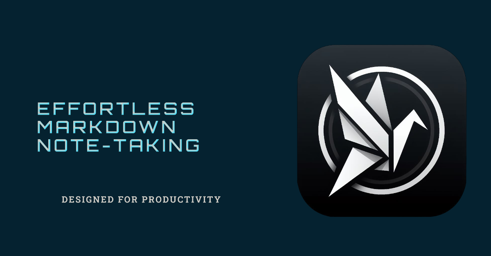

  

<h1 align="center">Markdown Note Taking App</h1>

## Project Description

Hey there! 👋 Welcome to the Markdown Note Taking App. I'm just your regular student who found taking notes a tad too dull and decided to amp it up a bit. This project brings together a bunch of technologies I love: SvelteKit, Tauri, and AI functionalities. The main star🌟, however, is its WYSIWYG (What You See Is What You Get) Markdown editing. This way, note-taking becomes smoother and way cooler.

## Table of Contents
- [Features](#features)
- [Roadmap](#roadmap)
- [Installation Instructions](#installation)
- [Usage Guidelines](#usage)
- [Credits](#credits)

## Features
The app so far can do:
- WYSIWYG Markdown editing (pretty neat!)
- Saving, creating, and deleting notes (actual note-taking)
- Custom titlebar (for that sleek look)
- An easy-to-navigate homepage

## Roadmap
Currently brewing in the code cauldron🧙‍♂️:
- Integrating more AI functions
- Kanban boards for organization
- Multiple themes because more is merrier
- User settings and plugins for customization
- Fixing bugs (those pesky creatures!)

## Installation

To get started with Markdown Note Taking App on your local machine:

1. Clone this repository to your local machine.
2. Navigate to the cloned folder, run `npm install` to set things up.
3. Fire up the application using `npm run start`.

## Usage

How to use the app:

1. Launch the application, welcome! 🎉
2. Register or login via the main page.
3. Ready, set, go! Start creating, saving, and editing your notes using Markdown.

There are a few screenshots to give you a sneak peek. Oh, and if there's any need for authentication details, the interface is all geared up to let you know.

## Screenshots

  
  

## Credits

Developed with friend and quite a few cups of coffee ☕ by [YOUR NAME OR GITHUB USERNAME].